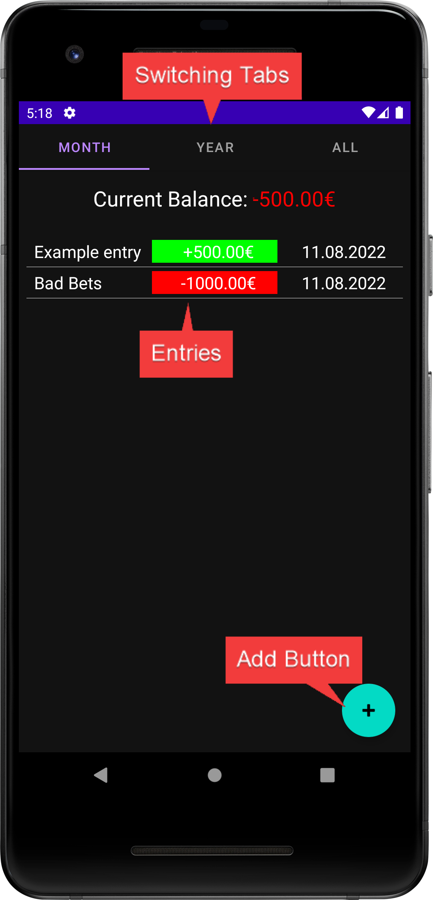
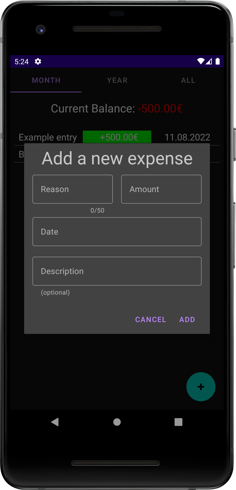
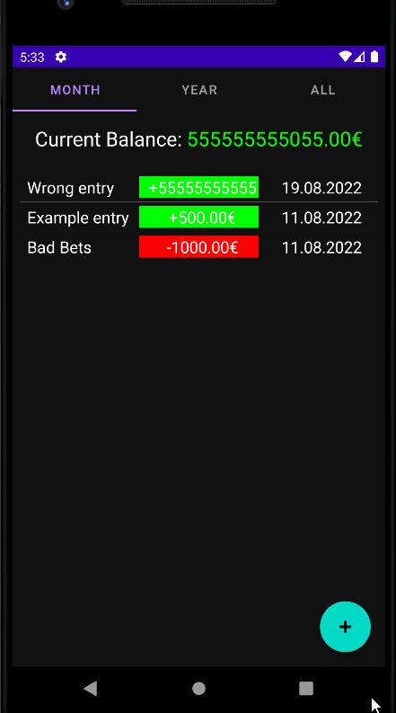

# Money

A minimal app to track your expenses. It's based on what my german parents used in their teens to track their money, which was called a [Haushaltsbuch](https://de.wikipedia.org/wiki/Haushaltsbuch).

## Functionality

You have 3 basic Tabs, **Month**, **Year** and **All** which show your spendings and earnings for the current month, current year or over the entire time respectively. The add Button allows you to enter an Expense, it's date and the amount you spent/earned. On the top the app will automatically will calculate your balance for you.

If you accidentally mistyped somewhere, you can just swipe that entry to the left to delete it.

Light and dark modes are supported, however the light mode looks somewhat wonky.
